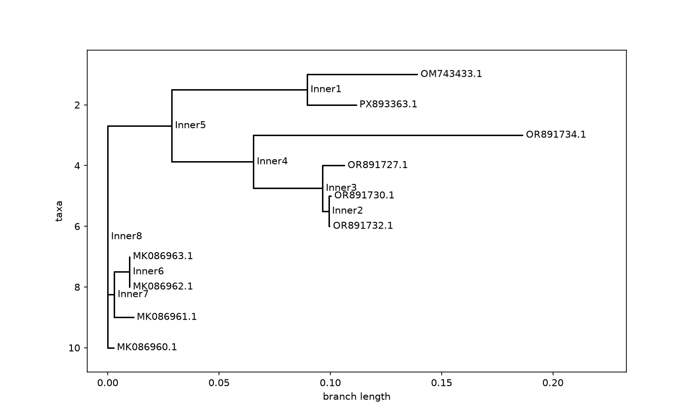

# Fusarium oxysporum Phylogenetic Analysis

## Overview
This project builds a phylogenetic tree from publicly available *Fusarium oxysporum* TEF1-alpha (translation elongation factor 1-alpha) gene sequences, to visualize genetic relationships between different strains of this economically important plant pathogen.

*Fusarium oxysporum* is a soil-borne fungal pathogen that causes wilt disease across a wide range of crops. It exists as many host-specific "formae speciales" (e.g. f. sp. *cubense* on banana, f. sp. *lycopersici* on tomato). TEF1-alpha is the standard gene marker used by researchers to distinguish and classify strains within this species, since the more commonly used ITS region does not resolve well within *Fusarium*.

## Data source
- **Database:** NCBI Nucleotide
- **Gene marker:** TEF1-alpha (translation elongation factor 1-alpha)
- **Sequences used:** 10 *Fusarium oxysporum* sequences (accessions: OR891732.1, MK086961.1, MK086962.1, MK086963.1, MK086960.1, OR891727.1, PX893363.1, OR891734.1, OM743433.1, OR891730.1)

## Method
1. Sequences were downloaded from NCBI Nucleotide in FASTA format
2. Multiple sequence alignment was performed using Clustal Omega (EMBL-EBI)
3. Genetic distances between all sequence pairs were calculated using the identity model (Biopython's `DistanceCalculator`)
4. A phylogenetic tree was constructed using the Neighbor-Joining method (Biopython's `DistanceTreeConstructor`)
5. The tree was visualized using Biopython's `Phylo.draw()` and matplotlib

## Results

The tree resolves the 10 sequences into distinct clusters:

- **MK086960, MK086961, MK086962, MK086963** form a tightly related group, suggesting these strains are closely related to one another.
- **OR891727, OR891730, OR891732** form a second closely related cluster.
- **OM743433 and PX893363** pair together on their own branch.
- **OR891734** stands apart from all other sequences with a notably longer branch length, indicating it is the most genetically distinct sequence in this dataset.

Checking each record on NCBI reveals a more nuanced pattern than host or geography alone:

- The four-member cluster (MK086960-963) are all isolates from **Citrus sinensis (orange) roots in Chile**, collected in 2022 — matching host, matching country, matching year.
- The three-member cluster (OR891727, OR891730, OR891732) are all isolates from **Fragaria chiloensis (strawberry) roots in Ecuador**, collected 2013-2015, by the same collector (Jairo Guevara).
- The two more distantly related singles come from very different origins: one from **Basella alba (Malabar spinach) in Malaysia**, and one from **Dactylis glomerata (orchard grass) in China**.

**The interesting exception is OR891734**, the clear outlier on the tree with the longest branch length. Despite being genetically the most distinct sequence in the whole dataset, it was *also* isolated from **Fragaria chiloensis roots in Ecuador**, by the same collector, in the same general period as the tightly-clustered Ecuador group. In other words, two strains from the same host, country, and even collector can be far more genetically distant from each other than two strains from entirely different hosts and continents.

This suggests that while host and geography do explain a large part of the clustering pattern seen here (the Chile and Ecuador groups are both genetically tight and geographically/host-consistent), *Fusarium oxysporum* also harbors real strain-level genetic diversity within a single host and location — meaning multiple distinct genetic lineages can co-occur infecting the same crop in the same field system. This is consistent with the known biology of *F. oxysporum*, which differentiates into host-adapted formae speciales but can also show genetic heterogeneity even within one forma specialis population.

## Limitations
- A sample of 10 sequences is small; a larger dataset would give a more robust picture of strain diversity.
- The "identity" distance model is a simple method; more sophisticated models (e.g. Kimura 2-parameter) account for different mutation rates and may refine the tree slightly.
- TEF1-alpha alone cannot always distinguish very closely related formae speciales; combining it with additional gene markers would strengthen classification.

## Files in this repository
- `fusarium_sequences.fasta` — original unaligned sequences downloaded from NCBI
- `fusarium_aligned.fa` — multiple sequence alignment (Clustal Omega output)
- `build_tree.py` — Python script for distance calculation, tree construction, and visualization
- `fusarium_tree.png` — the resulting phylogenetic tree

## Tools used
Python, Biopython, matplotlib, Clustal Omega (EMBL-EBI)
